# Pipelines and workflows

[`VoicePipeline`][agents.voice.pipeline.VoicePipeline] is a class that makes it easy to turn your agentic workflows into a voice app. You pass in a workflow to run, and the pipeline takes care of transcribing input audio, detecting when the audio ends, calling your workflow at the right time, and turning the workflow output back into audio.

```mermaid
graph LR
    %% Input
    A["🎤 Audio Input"]

    %% Voice Pipeline
    subgraph Voice_Pipeline [Voice Pipeline]
        direction TB
        B["Transcribe (speech-to-text)"]
        C["Your Code"]:::highlight
        D["Text-to-speech"]
        B --> C --> D
    end

    %% Output
    E["🎧 Audio Output"]

    %% Flow
    A --> Voice_Pipeline
    Voice_Pipeline --> E

    %% Custom styling
    classDef highlight fill:#ffcc66,stroke:#333,stroke-width:1px,font-weight:700;

```



## Configuring a pipeline

When you create a pipeline, you can set a few things:

1. The [`workflow`][agents.voice.workflow.VoiceWorkflowBase], which is the code that runs each time new audio is transcribed.
2. The [`speech-to-text`][agents.voice.model.STTModel] and [`text-to-speech`][agents.voice.model.TTSModel] models used
3. The [`config`][agents.voice.pipeline_config.VoicePipelineConfig], which lets you configure things like:
    - A model provider, which can map model names to models
    - Tracing, including whether to disable tracing, whether audio files are uploaded, the workflow name, trace IDs etc.
    - Settings on the TTS and STT models, like the prompt, language and data types used.

## Running a pipeline

You can run a pipeline via the [`run()`][agents.voice.pipeline.VoicePipeline.run] method, which lets you pass in audio input in two forms:

1. [`AudioInput`][agents.voice.input.AudioInput] is used when you have a full audio transcript, and just want to produce a result for it. This is useful in cases where you don't need to detect when a speaker is done speaking; for example, when you have pre-recorded audio or in push-to-talk apps where it's clear when the user is done speaking.
2. [`StreamedAudioInput`][agents.voice.input.StreamedAudioInput] is used when you might need to detect when a user is done speaking. It allows you to push audio chunks as they are detected, and the voice pipeline will automatically run the agent workflow at the right time, via a process called "activity detection".

## Results

The result of a voice pipeline run is a [`StreamedAudioResult`][agents.voice.result.StreamedAudioResult]. This is an object that lets you stream events as they occur. There are a few kinds of [`VoiceStreamEvent`][agents.voice.events.VoiceStreamEvent], including:

1. [`VoiceStreamEventAudio`][agents.voice.events.VoiceStreamEventAudio], which contains a chunk of audio.
2. [`VoiceStreamEventLifecycle`][agents.voice.events.VoiceStreamEventLifecycle], which informs you of lifecycle events like a turn starting or ending.
3. [`VoiceStreamEventError`][agents.voice.events.VoiceStreamEventError], is an error event.

```python

result = await pipeline.run(input)

async for event in result.stream():
    if event.type == "voice_stream_event_audio":
        # play audio
    elif event.type == "voice_stream_event_lifecycle":
        # lifecycle
    elif event.type == "voice_stream_event_error"
        # error
    ...
```

## Best practices

### Interruptions

The Agents SDK currently does not support any built-in interruptions support for [`StreamedAudioInput`][agents.voice.input.StreamedAudioInput]. Instead for every detected turn it will trigger a separate run of your workflow. If you want to handle interruptions inside your application you can listen to the [`VoiceStreamEventLifecycle`][agents.voice.events.VoiceStreamEventLifecycle] events. `turn_started` will indicate that a new turn was transcribed and processing is beginning. `turn_ended` will trigger after all the audio was dispatched for a respective turn. You could use these events to mute the microphone of the speaker when the model starts a turn and unmute it after you flushed all the related audio for a turn.

Once the pipeline is done processing all turns, the `stream()` method will complete and the context manager will exit.

## Real-time Voice Pipeline

The SDK includes a `RealtimeVoicePipeline` designed for direct, bidirectional voice interaction with newer, real-time capable models like OpenAI's `gpt-4o-realtime-preview`. This pipeline differs significantly from the standard `VoicePipeline`:

-   **Direct Voice-to-Voice:** It sends your audio directly to the real-time LLM and receives audio back from the LLM. There are no separate STT (Speech-to-Text) or TTS (Text-to-Speech) steps managed by this pipeline. The LLM handles both transcription and speech generation internally.
-   **Integrated Tool Calls:** If the LLM decides to use a tool, the pipeline will automatically execute it using the tools you provided during initialization and send the result back to the LLM. The pipeline emits `VoiceStreamEventToolCall` events so your application can log or display information about tool usage, but it does not need to perform any action in response to these events.
-   **Continuous Streaming:** It's designed for continuous audio input and output, facilitating more natural conversational turn-taking.

### Usage

The `RealtimeVoicePipeline` follows a similar pattern to the standard `VoicePipeline`:

1. Create a `StreamedAudioInput` instance
2. Configure a `VoicePipelineConfig` with real-time specific settings
3. Initialize the pipeline with a real-time model and any tools
4. Call `run()` to get a result that can be streamed
5. Process the events from the stream

#### Basic example:

```python
from agents.voice import (
    RealtimeVoicePipeline,
    StreamedAudioInput,
    VoicePipelineConfig
)
from agents.voice.models.sdk_realtime import SDKRealtimeLLM

# Create the input, config, and model
input_stream = StreamedAudioInput()
config = VoicePipelineConfig(
    realtime_settings={
        "turn_detection": "server_vad",  # Use server-side voice activity detection
        "system_message": "You are a helpful assistant.",
    }
)
model = SDKRealtimeLLM(model_name="gpt-4o-realtime-preview")

# Create the pipeline with tools
pipeline = RealtimeVoicePipeline(
    model=model,
    tools=[get_weather, get_time],
    config=config,
)

# Start the pipeline
result = await pipeline.run(input_stream)

# Process events from the pipeline
async for event in result.stream():
    # Handle different event types
    if isinstance(event, VoiceStreamEventAudio):
        # Play this audio to the user
        play_audio(event.data)
    elif isinstance(event, VoiceStreamEventToolCall):
        # Log tool usage (execution is automatic)
        log_tool_call(event.tool_name, event.arguments)
    # Handle other event types...

# Continuously send audio chunks to the pipeline
# There's no need to signal "end of audio" - the model handles turn-taking
while True:
    audio_chunk = record_audio_chunk()
    await input_stream.queue.put(audio_chunk)

    # If the application is closing, close the input
    if stopping:
        await input_stream.close()
        break
```

### Turn Detection Modes

The realtime models can operate in different turn detection modes, controlled via the `turn_detection` setting:

-   `"server_vad"` (default): The server automatically detects when the user has stopped speaking using Voice Activity Detection and starts responding.
-   `"manual"`: Your application explicitly signals when the user has finished speaking by calling `await llm_session.commit_audio_buffer()`.
-   `None`: Same as `"server_vad"` - the server handles turn detection automatically.

### Implementing Push-to-Talk

In push-to-talk mode, the application sends audio only when the user activates a button or key:

```python
# Start continuous silent audio (required for maintaining the connection)
async def send_continuous_audio():
    while True:
        if push_to_talk_active:
            # Send real audio when button is pressed
            audio = get_microphone_audio()
        else:
            # Send silence when button is not pressed
            audio = np.zeros(CHUNK_SIZE, dtype=np.int16)

        await input_stream.queue.put(audio)
        await asyncio.sleep(CHUNK_DURATION)  # Simulate real-time pacing

# When user releases the push-to-talk button
async def on_push_to_talk_released():
    # Optional: For manual turn detection, commit the buffer
    if turn_detection == "manual":
        await llm_session.commit_audio_buffer()
```

### Event Handling

When processing events from a `RealtimeVoicePipeline`, you'll handle these event types:

-   `VoiceStreamEventAudio`: Contains audio data from the LLM to play back to the user
-   `VoiceStreamEventLifecycle`: Indicates session lifecycle events (e.g., "turn_started", "turn_ended", "session_ended")
-   `VoiceStreamEventToolCall`: Provides information about tool calls being executed by the pipeline
-   `VoiceStreamEventError`: Indicates an error condition

### Key Differences & Important Notes

-   **Continuous Audio**: The realtime pipeline expects continuous audio input, not discrete turns ending with a `None` sentinel. Use `input_stream.close()` only when shutting down the pipeline entirely.
-   **Event Types**: You'll receive `VoiceStreamEventToolCall` events for informational purposes when tools are used. The pipeline automatically executes registered tools and sends results back to the LLM - no action is needed from your application.
-   **No Separate STT/TTS Events**: You will receive `VoiceStreamEventAudio` directly from the LLM. There are no separate events indicating STT transcription completion or explicit text-to-speech stages within this pipeline's event stream.
-   **Configuration**: Real-time model specific settings (like assistant voice, system message, or turn detection mode) are passed via the `realtime_settings` dictionary within `VoicePipelineConfig`.
-   **Audio Format**: The OpenAI realtime models currently require **16-bit PCM at a 24 kHz sample rate, mono, little-endian** for both _input_ and _output_ when you use the default `pcm16` format. Make sure your microphone capture (`StreamedAudioInput`) and speaker playback are configured for **24 kHz** to avoid chip-munk / slow-motion artefacts.

```python
INPUT_SAMPLE_RATE = 24_000  # 24 kHz for mic capture
OUTPUT_SAMPLE_RATE = 24_000  # 24 kHz for TTS playback
```

Failing to match this sample-rate is the most common cause of distorted or "slow" audio.

For complete working examples, see:

-   [`realtime_assistant.py`](https://github.com/openai/openai-agents-python/blob/main/examples/voice/realtime_assistant.py) - Basic example with simulated audio
-   [`continuous_realtime_assistant.py`](https://github.com/openai/openai-agents-python/blob/main/examples/voice/continuous_realtime_assistant.py) - Example showing continuous streaming with push-to-talk simulation

Note that these examples require approved access to the OpenAI `gpt-4o-realtime-preview` model.

### New transcription events

When you enable `input_audio_transcription` in the session configuration (the realtime pipeline does this automatically), the server can stream _your_ microphone audio back as text. Two new event types are surfaced by the SDK so you can inspect what the model thinks it heard:

-   `RealtimeEventInputAudioTranscriptionDelta` – incremental partial transcripts
-   `RealtimeEventInputAudioTranscriptionCompleted` – the final transcript for that user turn

```python
elif isinstance(event, RealtimeEventInputAudioTranscriptionDelta):
    print("you (partial):", event.delta)
elif isinstance(event, RealtimeEventInputAudioTranscriptionCompleted):
    print("you (final):", event.transcript)
```

These are invaluable for debugging cases where echo or background noise is being mis-interpreted by the model.

### Echo & feedback mitigation

If you hear the assistant repeatedly greeting you ("Hello again!") it usually means your microphone is re-capturing the speaker audio. Combine these techniques:

1.  Enable the built-in echo / noise suppression with

    ```python
    realtime_settings={"input_audio_noise_reduction": {}}
    ```

2.  In push-to-talk interfaces, _pause_ mic streaming for ~300 ms after the last assistant audio chunk. See `ASSISTANT_AUDIO_SILENCE_BUFFER_S` in `continuous_realtime_assistant.py`.

3.  Use headphones for the cleanest experience.
